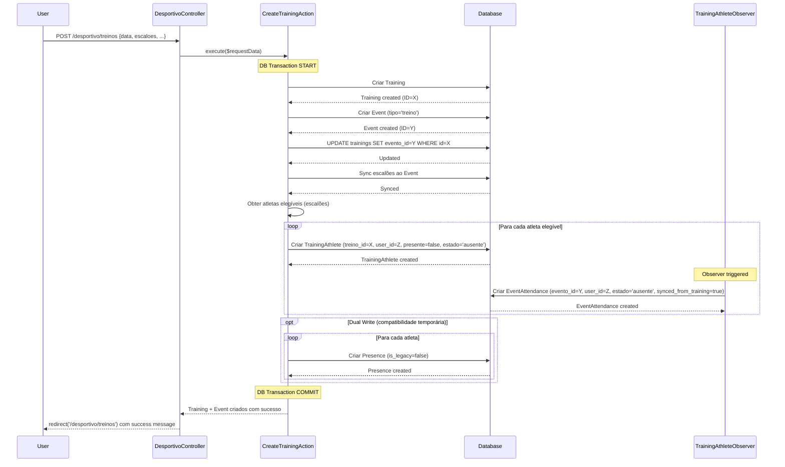
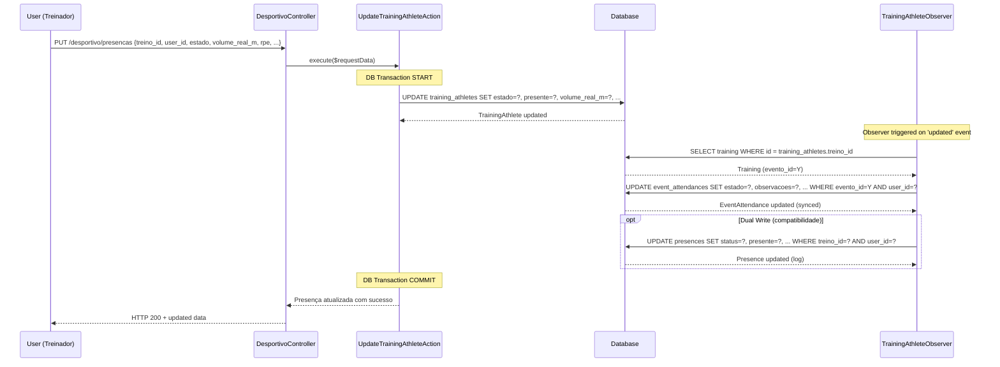
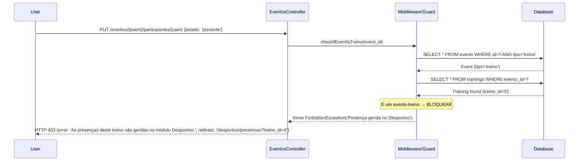
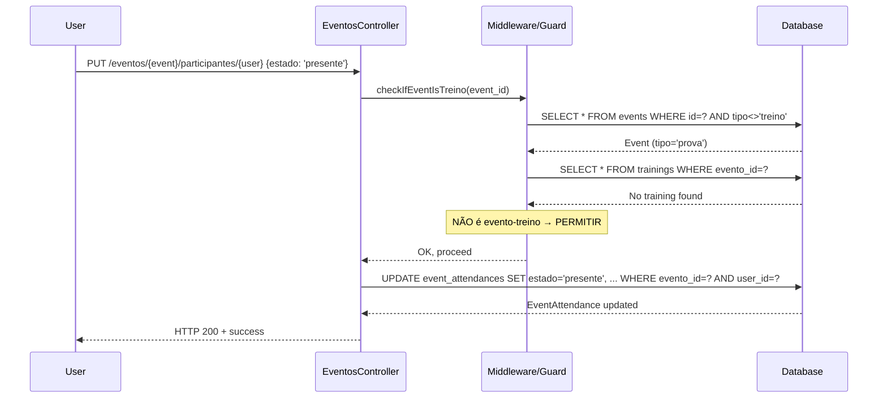
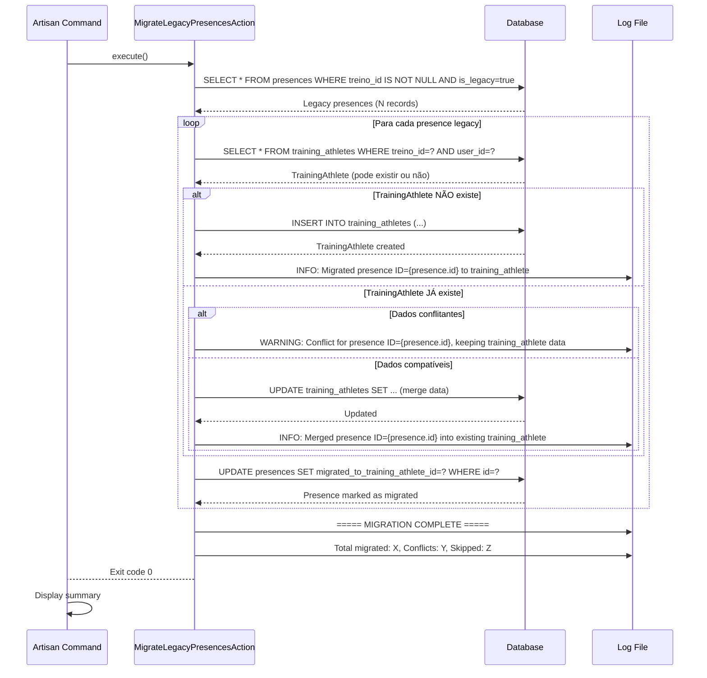

# Arquitetura Alvo - Refactor Módulo Desportivo
**Data:** 2026-03-09  
**Projeto:** ClubOS  
**Fase:** 2/10 - Especificação da Arquitetura Final

---

## OBJETIVO

Definir a arquitetura final do módulo Desportivo e sua integração com Eventos, Presenças e Config

urações, **antes** de iniciar a implementação da refatoração.

Este documento serve como **contrato técnico** para todas as fases seguintes.

---

## 1. PRINCÍPIOS ARQUITETURAIS

### 1.1 Single Source of Truth

| Conceito | Fonte de Verdade | Tabelas Espelho | Tabelas Legacy |
|----------|------------------|-----------------|----------------|
| **Presença em Treino** | `training_athletes` | `event_attendances` | `presences` |
| **Presença em Evento (não-treino)** | `event_attendances` | - | - |
| **Sessão de Treino** | `trainings` | - | `training_sessions` |
| **Atleta** | `users` | - | - |
| **Evento** | `events` | - | - |

### 1.2 Hierarquia de Autoridade

```
1. training_athletes    → manda em execução individual de treino
2. event_attendances    → espelha treino E manda em eventos não-treino
3. trainings            → manda em sessão técnica
4. training_sessions    → DESCONTINUADA (ou fundida em trainings)
5. presences            → LOG HISTÓRICO apenas (não mais fonte operacional)
6. users                → entidade central SEMPRE
```

### 1.3 Responsabilidades por Módulo

| Módulo | Responsável por | NÃO Responsável por |
|--------|-----------------|---------------------|
| **Desportivo** | Criar treinos, gerir execução individual, planeamento, periodização | Criar eventos gerais, faturação |
| **Eventos** | Criar eventos gerais, gerir convocatórias, gerir attendances de não-treinos | Editar presenças de treinos |
| **Financeiro** | Faturação, movimentos, conciliação | Criar inscrições desportivas |
| **Configurações** | Catálogos técnicos, tipos, estados, parametrização | Lógica de negócio |

---

## 2. ENTIDADES MASTER VS ESPELHO

### 2.1 Tabela Master: `training_athletes`

**Responsabilidade:** Fonte de verdade para execução individual de treino.

**Dados que Armazena:**
- Quem participou (`user_id`)
- Em que treino (`treino_id`)
- Estado da participação (`presente`, `estado`)
- Execução real (`volume_real_m`, `rpe`)
- Observações técnicas (`observacoes_tecnicas`)
- Auditoria (`registado_por`, `registado_em`)

**Regras de Escrita:**
- ✅ Escrita primária: Desportivo Controller/Actions
- ✅ Atualização: Apenas via Desportivo
- ❌ Bloqueada para: Eventos, outros módulos

**Sincronização:**
- Quando alterada → sincroniza automaticamente para `event_attendances` (via Observer)

**Lifecycle:**
- **Criação:** Ao criar `Training`, pré-criar registos para todos atletas elegíveis do grupo/escalão
- **Atualização:** Via endpoint `desportivo.presencas.update`
- **Delete:** Cascade quando `Training` é apagado

**Schema (reforço):**
```php
Schema::create('training_athletes', function (Blueprint $table) {
    $table->uuid('id')->primary();
    $table->uuid('treino_id');           // FK trainings (CASCADE)
    $table->uuid('user_id');             // FK users (CASCADE)
    $table->boolean('presente')->default(false);
    $table->string('estado', 30)->nullable();  // presente|ausente|justificado|lesionado|limitado
    $table->integer('volume_real_m')->nullable();
    $table->integer('rpe')->nullable();  // 1-10 escala RPE
    $table->text('observacoes_tecnicas')->nullable();
    $table->uuid('registado_por')->nullable();  // FK users (SET NULL)
    $table->datetime('registado_em')->nullable();
    $table->timestamps();
    
    $table->unique(['treino_id', 'user_id']);
   $table->foreign('treino_id')->references('id')->on('trainings')->onDelete('cascade');
    $table->foreign('user_id')->references('id')->on('users')->onDelete('cascade');
    $table->foreign('registado_por')->references('id')->on('users')->onDelete('set null');
    
    $table->index(['treino_id', 'presente']);
    $table->index('user_id');
    $table->index('estado');
});
```

### 2.2 Tabela Espelho: `event_attendances`

**Responsabilidade Dupla:**
1. **Para eventos não-treino:** Fonte de verdade de participação
2. **Para eventos-treino:** Espelho sincronizado de `training_athletes`

**Regras de Escrita:**
- ✅ Escrita primária (eventos não-treino): Eventos Controller
- ✅ Sincronização automática (eventos-treino): Observer de `TrainingAthlete`
- ❌ Bloqueada para edição direta (eventos-treino): Quando `event.tipo === 'treino'`

**Mapeamento de Estados (Treino → Evento):**
| `training_athletes.estado` | `event_attendances.estado` |
|---------------------------|---------------------------|
| `'presente'` | `'presente'` |
| `'ausente'` | `'ausente'` |
| `'justificado'` | `'justificado'` |
| `'lesionado'` | `'justificado'` (ou criar estado específico)|
| `'limitado'` | `'presente'` (com observações) |

**Schema (reforço com flag):**
```php
Schema::table('event_attendances', function (Blueprint $table) {
    // Campos existentes mantidos
    // Adicionar flag de controlo (opcional):
    $table->boolean('synced_from_training')->default(false)->after('provas');
    $table->uuid('training_athlete_id')->nullable()->after('synced_from_training');
    
    $table->foreign('training_athlete_id')
          ->references('id')
          ->on('training_athletes')
          ->onDelete('set null');
});
```

**Lifecycle (Eventos-Treino):**
- **Criação:** Quando `Training` é criado, cria-se espelho em `event_attendances`
- **Atualização:** Quando `TrainingAthlete` é atualizado, sincroniza `EventAttendance`
- **Delete:** Quando `Training` é apagado, cascade apaga `Event` e respetivos `EventAttendances`

### 2.3 Tabela Master: `trainings`

**Responsabilidade:** Fonte de verdade para sessão técnica de treino.

**Ponte Crítica:**
- `trainings.evento_id` → FK para `events`
- Garante que **cada treino tem 1 evento associado**
- **Relação 1:1 obrigatória**

**Regras de Criação:**
```
Criar Training
  ↓
1. Criar Training record
2. Criar Event record (tipo='treino')
3. Atualizar trainings.evento_id = event.id
4. Sync escalões ao Event
5. Pré-criar training_athletes para atletas elegíveis
6. Pré-criar event_attendances (espelho)
7. (Opcional) Criar presences para log histórico
```

**Schema (mantido):**
```php
Schema::create('trainings', function (Blueprint $table) {
    // Schema completo já existe, manter
    // CRÍTICO: trainings.evento_id deve ser NOT NULL após refactor
});
```

### 2.4 Tabela Master: `events`

**Responsabilidade:** Fonte de verdade para eventos gerais.

**Tipos Especiais:**
- `tipo = 'treino'` → Evento criado automaticamente para treino
- `tipo = 'prova'` → Competição
- `tipo = 'evento_interno'` → Outros

**Relação com Trainings:**
```php
// Event model
public function trainings(): HasMany
{
    return $this->hasMany(Training::class, 'evento_id');
}

public function isTreino(): bool
{
    return $this->tipo === 'treino' && $this->trainings()->exists();
}
```

**Bloqueio de Edição:**
```php
// EventosController ou Middleware
if ($event->isTreino()) {
    throw new \Exception('As presenças deste treino são geridas no módulo Desportivo.');
}
```

### 2.5 Tabela Legacy: `presences`

**Responsabilidade:** Log histórico e compatibilidade temporária.

**Estado Futuro:**
- ❌ **NÃO** é mais fonte de verdade operacional
- ✅ Manter registos históricos existentes
- ✅ Opcional: continuar a escrever durante transição (dual write)
- ✅ Queries legacy podem continuar a ler (compatibilidade)

**Flag de Controlo:**
```php
Schema::table('presences', function (Blueprint $table) {
    $table->boolean('is_legacy')->default(true)->after('notas');
    $table->uuid('migrated_to_training_athlete_id')->nullable();
    
    $table->index('is_legacy');
});
```

**Estratégia de Transição:**
1. **Fase 1:** Dual write (escrever em `presences` + `training_athletes`)
2. **Fase 2:** Migrar dados antigos via comando artisan
3. **Fase 3:** Parar escrita em `presences`
4. **Fase 4:** (Futuro) Converter em view read-only ou archive table

### 2.6 Tabela para Descontinuar: `training_sessions`

**Responsabilidade:** Nenhuma (redundante).

**Análise:**
- ✅ Não é usada no código atual
- ✅ Pode ter dados legacy (a verificar)

**Estratégia:**
1. Auditoria: `php artisan desportivo:auditar-training-sessions`
2. Se vazia: Marcar como deprecated, manter estrutura por segurança
3. Se com dados: Migrar para `trainings`, depois marcar deprecated
4. Futuro: Remover após validação completa (6+ meses)

---

## 3. FLUXOS END-TO-END

### 3.1 Fluxo: Criação de Treino

**Trigger:** User cria treino no módulo Desportivo

**Sequência (Arquitetura Alvo):**



**Componentes Necessários:**
- `CreateTrainingAction` (service)
- `PrepareTrainingAthletesAction` (service)
- `SyncTrainingEventAction` (service)
- `TrainingAthleteObserver` (observer)

### 3.2 Fluxo: Atualização de Presença de Treino

**Trigger:** User marca presença no módulo Desportivo

**Sequência:**



**Componentes Necessários:**
- `UpdateTrainingAthleteAction`
- `TrainingAthleteObserver::updated()`

### 3.3 Fluxo: Tentativa de Edição de Presença em Evento-Treino (BLOQUEADO)

**Trigger:** User tenta editar attendance de um evento que é treino

**Sequência:**



**Componentes Necessários:**
- `Event::isTreino()` method
- Middleware ou Guard em `EventosController`
- Frontend: detetar evento-treino e mostrar bloqueio

### 3.4 Fluxo: Edição Livre de Presença em Evento Não-Treino

**Trigger:** User edita attendance de evento normal (prova, evento interno, etc.)

**Sequência:**



### 3.5 Fluxo: Migração de Dados Legacy

**Trigger:** Comando artisan `php artisan desportivo:migrar-presencas-legacy`

**Sequência:**



**Componentes Necessários:**
- `app/Console/Commands/MigrarPresencasLegacy.php`
- `app/Services/Desportivo/MigrateLegacyPresencesAction.php`

---

## 4. FLUXO ENTRE MÓDULOS

### 4.1 Desportivo → Eventos

**Ponte:** `trainings.evento_id` FK

**Fluxo de Dados:**
```
Desportivo cria Training
  ↓
Desportivo cria Event (tipo='treino')
  ↓
Training.evento_id = Event.id
  ↓
Event aparece no calendário de Eventos
  ↓
training_athletes sincroniza para event_attendances
  ↓
Eventos mostra attendances (read-only se treino)
```

**Responsabilidades:**
- **Desportivo:** Dono do ciclo de vida do Training + Event-treino
- **Eventos:** Exibe calendário, mas **não edita** se for treino

### 4.2 Desportivo ↔ Financeiro

**Pontes:** `competition_registrations.fatura_id`, `competition_registrations.movimento_id`

**Fluxo de Dados:**
```
Desportivo cria CompetitionRegistration (atleta inscrito em prova)
  ↓
CompetitionRegistration tem `custo_inscricao`
  ↓
Financeiro CONSOME este facto (via listener ou manual)
  ↓
Financeiro cria Invoice/Movement
  ↓
Competition Registration.fatura_id = Invoice.id
  ↓
Desportivo pode consultar estado de pagamento (read-only)
```

**Responsabilidades:**
- **Desportivo:** Cria factos (inscrições, custos)
- **Financeiro:** Gere faturação, pagamentos, conciliação

**Decisão:** Manter acoplamento **mínimo e unidirecional** (Financeiro lê Desportivo, nunca o contrário para escrita)

### 4.3 Configurações → Desportivo

**Relação:** Configurações fornece catálogos técnicos

**Fluxo:**
```
Configurações define:
  - Estados de atleta (ativo, inativo, lesionado, ...)
  - Motivos de ausência
  - Tipos de treino
  - Zonas de treino
  - Tipos de prova
  - etc.
  ↓
Desportivo CONSOME estes catálogos via selects/dropdowns
  ↓
Validação de dados usa estes catálogos
```

**Responsabilidades:**
- **Configurações:** CRUD de catálogos técnicos
- **Desportivo:** Usa catálogos, não os cria

---

## 5. TABELA POR TABELA: DECISÕES

| Tabela | Decisão | Ação | Prioridade | Fase |
|--------|---------|------|-----------|------|
| **training_athletes** | ✅ MANTER e PROMOVER a Master | Tornar fonte de verdade operacional | 🔴 Alta | FASE 3-5 |
| **trainings** | ✅ MANTER como Master | Reforçar NOT NULL em `evento_id` | 🔴 Alta | FASE 3 |
| **event_attendances** | ✅ MANTER e EXPANDIR | Adicionar sincronização com trainings | 🔴 Alta | FASE 3-5 |
| **events** | ✅ MANTER como Master | Adicionar método `isTreino()`, bloqueio de edição | 🟠 Média | FASE 6 |
| **presences** | ⚠️ MANTER como Legacy | Parar escrita operacional, manter histórico | 🟠 Média | FASE 8 |
| **training_sessions** | ⚠️ DESCONTINUAR | Auditar dados, migrar se necessário, deprecated | 🟡 Baixa | FASE 8 |
| **training_series** | ✅ MANTER | Nenhuma ação (suporte técnico) | 🟢 Baixa | N/A |
| **users** | ✅ MANTER | Nenhuma ação (entidade central) | N/A | N/A |
| **seasons, macrocycles, mesocycles, microcycles** | ✅ MANTER | Nenhuma ação (planeamento) | N/A | N/A |
| **age_groups** | ✅ MANTER | Nenhuma ação (escalões) | N/A | N/A |
| **event_types, event_type_configs** | ✅ MANTER e EXPANDIR | Adicionar configs para evento-treino | 🟡 Baixa | FASE 7 |
| **competitions, comp_registrations, provas, results** | ✅ MANTER | Nenhuma ação (módulo competições) | N/A | N/A |

---

## 6. ESTRATÉGIA DE BACKWARD COMPATIBILITY

### 6.1 Dual Write (Fase Transição)

**Período:** FASE 5-8 (durante refactor de controllers)

**Estratégia:**
```php
// CreateTrainingAction
DB::transaction(function () {
    // 1. Criar training_athletes (NOVO - Master)
    $trainingAthlete = TrainingAthlete::create([...]);
    
    // 2. Sincronizar para event_attendances (NOVO - Espelho)
    EventAttendance::create([...]);
    
    // 3. OPCIONAL: Continuar a escrever em presences (compatibilidade)
    if (config('desportivo.legacy_presences_enabled', true)) {
        Presence::create([
            ...
            'is_legacy' => false,  // Marca como novo registo (não legacy)
        ]);
    }
});
```

**Config:**
```php
// config/desportivo.php
return [
    'legacy_presences_enabled' => env('DESPORTIVO_LEGACY_PRESENCES', true),
    // Depois de migração completa, mudar para false
];
```

### 6.2 Database Views (Opcional)

Criar view SQL que une `training_athletes` + `presences` legacy:

```sql
CREATE OR REPLACE VIEW presences_unified AS
-- Registos de training_athletes (fonte master)
SELECT 
    ta.id AS source_id,
    'training_athletes' AS source_table,
    ta.user_id,
    t.data,
    ta.treino_id,
    'treino' AS tipo,
    ta.estado AS status,
    ta.presente,
    NULL AS justificacao,  -- training_athletes não tem este campo
    ta.volume_real_m AS distancia_realizada_m,
    NULL AS classificacao,
    ta.observacoes_tecnicas AS notas,
    ta.created_at,
    ta.updated_at
FROM training_athletes ta
JOIN trainings t ON t.id = ta.treino_id

UNION ALL

-- Registos legacy de presences (só os que NÃO foram migrados)
SELECT 
    p.id AS source_id,
    'presences' AS source_table,
    p.user_id,
    p.data,
    p.treino_id,
    p.tipo,
    p.status,
    p.presente,
    p.justificacao,
    p.distancia_realizada_m,
    p.classificacao,
    p.notas,
    p.created_at,
    p.updated_at
FROM presences p
WHERE p.is_legacy = true 
   OR NOT EXISTS (
       SELECT 1 FROM training_athletes ta2 
       WHERE ta2.treino_id = p.treino_id 
         AND ta2.user_id = p.user_id
   );
```

**Uso:**
- Relatórios podem consultar `presences_unified` sem breaking change
- Progressivamente migrar queries para `training_athletes` diretamente

### 6.3 API Versioning (Não Necessário)

**Decisão:** Não usar API versioning para este refactor.

**Razão:** 
- Inertia.js não expõe API pública externa
- Todas mudanças são internas ao sistema
- Frontend e backend são deployados juntos

---

## 7. ESTRATÉGIA DE ROLLBACK

### 7.1 Rollback de Migrations

**Por Fase:**

| Fase | Migrations Criadas | Rollback Command | Risco de Data Loss |
|------|-------------------|------------------|-------------------|
| FASE 3 | Migrations de suporte | `php artisan migrate:rollback --step=4` | 🟢 Baixo (sem delete) |
| FASE 8 | Migration de flag legacy | `php artisan migrate:rollback --step=1` | 🟢 Baixo (apenas flag) |

**Todas migrations devem ter método `down()` funcional:**

```php
public function down(): void
{
    // Reverter alterações
    // NUNCA apagar dados em down()
    // Apenas remove constraints/índices/colunas adicionadas
}
```

### 7.2 Rollback de Código

**Estratégia Git:**
```bash
# Rollback de um commit específico
git revert <commit-hash>

# Rollback de uma fase completa (branch)
git checkout main
git reset --hard <commit-before-phase>  # Apenas em local
git push --force  # ⚠️ Cuidado em produção
```

**Branches por Fase:**
```
main
  ↓
refactor/desportivo-fase-3-migrations
  ↓
refactor/desportivo-fase-4-services
  ↓
refactor/desportivo-fase-5-controllers
  ↓
...
```

**Processo Seguro:**
1. Cada fase é uma branch separada
2. Merge para `main` apenas após validação
3. Tag de release após cada fase: `v1.5.0-fase-3`, `v1.5.0-fase-4`, etc.
4. Rollback via `git checkout tag`

### 7.3 Rollback de Dados (Dual Write)

Se dual write estiver ativo:

**Cenário 1:** Rollback de controllers, manter migrations
```
Estado: training_athletes + presences ambas escritas
Rollback: Mudar controllers para ler de presences
Resultado: Sem perda de dados, sistema volta ao estado anterior
```

**Cenário 2:** Rollback completo
```
php artisan migrate:rollback --step=N
git checkout <tag-before-refactor>
composer install
npm install && npm run build
php artisan config:clear
php artisan route:clear
php artisan view:clear
```

**Recovery de Dados:**
- Se `presences` mantida com dual write → dados duplicados mas recuperáveis
- Se `training_athletes` rollback → usar backup de DB

---

## 8. NOVA ÁREA: CONFIGURAÇÕES > DESPORTIVO

### 8.1 Objetivo

Centralizar **todos catálogos técnicos** do módulo Desportivo numa área de configuração, evitando hardcode e permitindo personalização.

### 8.2 Catálogos Necessários

| Catálogo | Tabela | Campos | Uso em |
|----------|--------|--------|--------|
| **Estados de Atleta** | `athlete_statuses` | `codigo`, `nome`, `cor`, `ativo`, `ordem` | training_athletes.estado |
| **Motivos de Ausência** | `absence_reasons` | `codigo`, `nome`, `requer_justificacao`, `ativo` | presences.justificacao |
| **Motivos de Lesão** | `injury_reasons` | `codigo`, `nome`, `gravidade`, `ativo` | athlete_sports_data |
| **Tipos de Treino** | `training_types` | `codigo`, `nome`, `descricao`, `ativo` | trainings.tipo_treino |
| **Zonas de Treino** | `training_zones` | `nome`, `percentagem_min`, `percentagem_max`, `cor`, `ativo` | training_series |
| **Tipos de Série** | `series_types` | `codigo`, `nome`, `descricao`, `ativo` | training_series.tipo |
| **Parâmetros de Carga** | `load_parameters` | `nome`, `unidade`, `min`, `max`, `ativo` | training_athletes.r pe, volume |
| **Tipos de Prova** | `prova_tipos` | **JÁ EXISTE** | provas.tipo_prova_id |
| **Tipos de Competição** | `competition_types` | `codigo`, `nome`, `nivel_importancia`, `ativo` | competitions.tipo |
| **Tipos de Piscina** | `pool_types` | `nome`, `comprimento_m`, `ativo` | events.tipo_piscina |

### 8.3 Schema Exemplo: `athlete_statuses`

```php
Schema::create('athlete_status_configs', function (Blueprint $table) {
    $table->uuid('id')->primary();
    $table->string('codigo', 30)->unique();  // ex: 'presente', 'ausente', 'justificado'
    $table->string('nome', 100);
    $table->string('nome_en', 100)->nullable();  // i18n futuro
    $table->string('descricao')->nullable();
    $table->string('cor', 7)->default('#6B7280');  // hex color
    $table->boolean('ativo')->default(true);
    $table->integer('ordem')->default(0);  // para sorting em selects
    $table->timestamps();
    
    $table->index('ativo');
    $table->index('ordem');
});
```

### 8.4 Seeders Base

```php
// database/seeders/ConfiguracoesDesportivoSeeder.php
class ConfiguracoesDesportivoSeeder extends Seeder
{
    public function run(): void
    {
        // Estados de Atleta
        DB::table('athlete_status_configs')->insert([
            ['codigo' => 'presente', 'nome' => 'Presente', 'cor' => '#10B981', 'ordem' => 1],
            ['codigo' => 'ausente', 'nome' => 'Ausente', 'cor' => '#EF4444', 'ordem' => 2],
            ['codigo' => 'justificado', 'nome' => 'Ausência Justificada', 'cor' => '#F59E0B', 'ordem' => 3],
            ['codigo' => 'lesionado', 'nome' => 'Lesionado', 'cor' => '#DC2626', 'ordem' => 4],
            ['codigo' => 'limitado', 'nome' => 'Treino Limitado', 'cor' => '#FBBF24', 'ordem' => 5],
        ]);
        
        // Tipos de Treino
        DB::table('training_type_configs')->insert([
            ['codigo' => 'tecnico', 'nome' => 'Treino Técnico'],
            ['codigo' => 'resistencia', 'nome' => 'Treino de Resistência'],
            ['codigo' => 'velocidade', 'nome' => 'Treino de Velocidade'],
            ['codigo' => 'tapering', 'nome' => 'Tapering'],
            ['codigo' => 'regeneracao', 'nome' => 'Regeneração'],
        ]);
        
        // ... outros catálogos
    }
}
```

### 8.5 Controllers CRUD

```php
// app/Http/Controllers/ConfiguracoesDesportivoController.php
class ConfiguracoesDesportivoController extends Controller
{
    public function index(): Response
    {
        return Inertia::render('Configuracoes/Desportivo/Index', [
            'athleteStatuses' => AthleteStatusConfig::orderBy('ordem')->get(),
            'trainingTypes' => TrainingTypeConfig::where('ativo', true)->get(),
            // ... outros catálogos
        ]);
    }
    
    public function storeAthleteStatus(Request $request): RedirectResponse
    {
        $validated = $request->validate([
            'codigo' => 'required|string|max:30|unique:athlete_status_configs',
            'nome' => 'required|string|max:100',
            'cor' => 'nullable|string|size:7|regex:/^#[0-9A-Fa-f]{6}$/',
            'ordem' => 'nullable|integer',
        ]);
        
        AthleteStatusConfig::create($validated);
        
        return redirect()->back()->with('success', 'Estado criado com sucesso!');
    }
    
    // ... outros CRUDs
}
```

### 8.6 Routes

```php
// routes/web.php
Route::prefix('configuracoes/desportivo')->group(function () {
    Route::get('/', [ConfiguracoesDesportivoController::class, 'index'])
        ->name('configuracoes.desportivo.index');
    
    // Athlete Statuses
    Route::post('/estados-atleta', [ConfiguracoesDesportivoController::class, 'storeAthleteStatus'])
        ->name('configuracoes.desportivo.estados-atleta.store');
    Route::put('/estados-atleta/{status}', [ConfiguracoesDesportivoController::class, 'updateAthleteStatus'])
        ->name('configuracoes.desportivo.estados-atleta.update');
    Route::delete('/estados-atleta/{status}', [ConfiguracoesDesportivoController::class, 'destroyAthleteStatus'])
        ->name('configuracoes.desportivo.estados-atleta.destroy');
    
    // Training Types
    Route::post('/tipos-treino', [ConfiguracoesDesportivoController::class, 'storeTrainingType'])
        ->name('configuracoes.desportivo.tipos-treino.store');
    // ... etc
});
```

### 8.7 Frontend (React)

```tsx
// resources/js/Pages/Configuracoes/Desportivo/Index.tsx
export default function ConfiguracoesDesportivoIndex({ athleteStatuses, trainingTypes, ... }) {
    return (
        <AuthenticatedLayout>
            <Head title="Configurações Desportivas" />
            
            <Tabs defaultValue="estados">
                <TabsList>
                    <TabsTrigger value="estados">Estados de Atleta</TabsTrigger>
                    <TabsTrigger value="tipos-treino">Tipos de Treino</TabsTrigger>
                    <TabsTrigger value="zonas">Zonas de Treino</TabsTrigger>
                    {/* ... outras tabs */}
                </TabsList>
                
                <TabsContent value="estados">
                    <AthleteStatusesTable data={athleteStatuses} />
                </TabsContent>
                
                {/* ... outros conteúdos */}
            </Tabs>
        </AuthenticatedLayout>
    );
}
```

---

## 9. ESQUEMA RESUMO DA ARQUITETURA FINAL

```
┌─────────────────────────────────────────────────────────────┐
│                    MÓDULO DESPORTIVO                        │
└─────────────────────────────────────────────────────────────┘
                              │
        ┌─────────────────────┼─────────────────────┐
        │                     │                     │
        ▼                     ▼                     ▼
   ┌─────────┐          ┌──────────┐         ┌─────────┐
   │ Treinos │          │ Presenças│         │  Plano  │
   └─────────┘          └──────────┘         └─────────┘
        │                     │                     │
        │                     │                     │
        ▼                     ▼                     ▼
┌──────────────┐    ┌──────────────────┐    ┌──────────────┐
│  trainings   │───▶│training_athletes │    │   seasons    │
│  (Master)    │    │    (MASTER)      │    │ macrocycles  │
│              │    │                  │    │ mesocycles   │
│ evento_id FK │    │ presente         │    │ microcycles  │
└──────────────┘    │ estado           │    └──────────────┘
        │           │ volume_real_m    │
        │           │ rpe              │
        │           │ observacoes_tecn │
        │           └──────────────────┘
        │                     │
        │                     │ (sincroniza via Observer)
        │                     │
        ▼                     ▼
┌──────────────┐    ┌──────────────────┐
│    events    │◀───│event_attendances │
│  (Master)    │    │    (ESPELHO)     │
│              │    │                  │
│ tipo='treino'│    │synced_from_train │
└──────────────┘    └──────────────────┘
        │                     
        ▼                     
┌──────────────────────────────────────┐
│        MÓDULO EVENTOS                │
│                                      │
│ - Exibe calendário                   │
│ - Gere attendances de não-treinos   │
│ - BLOQUEIA edição se treino          │
└──────────────────────────────────────┘

┌──────────────────────────────────────┐
│     CONFIGURAÇÕES > DESPORTIVO       │
│                                      │
│ - Catálogos Técnicos (CRUDs)        │
│ - Estados, Tipos, Zonas, etc.       │
└──────────────────────────────────────┘

┌──────────────────────────────────────┐
│     TABELAS LEGACY (DESCONTINUADAS)  │
│                                      │
│ - presences (log histórico)          │
│ - training_sessions (deprecated)     │
└──────────────────────────────────────┘
```

---

## 10. CONTRATOS DE INTERFACE

### 10.1 Métodos Obrigatórios em Models

#### Training Model

```php
class Training extends Model
{
    // Já existe
    public function event(): BelongsTo;
    public function athleteRecords(): HasMany;
    
    // A adicionar
    public function syncToEvent(): void;
    public function createAthleteRecords(array $athleteIds): void;
}
```

#### Event Model

```php
class Event extends Model
{
    // Já existe
    public function trainings(): HasMany;
    
    // A adicionar
    public function isTreino(): bool;
    public function canEditAttendances(): bool;  // false se isTreino()
}
```

#### TrainingAthlete Model

```php
class TrainingAthlete extends Model
{
    // Já existe
    public function training(): BelongsTo;
    public function atleta(): BelongsTo;
    
    // A adicionar (via Observer)
    protected static function booted(): void
    {
        static::updated(function (TrainingAthlete $trainingAthlete) {
            // Sincronizar para EventAttendance
        });
    }
}
```

### 10.2 Actions Obrigatórias

```php
namespace App\Services\Desportivo;

interface CreateTrainingActionInterface
{
    public function execute(array $data): Training;
}

interface UpdateTrainingAthleteActionInterface
{
    public function execute(TrainingAthlete $trainingAthlete, array $data): TrainingAthlete;
}

interface SyncTrainingToEventActionInterface
{
    public function execute(Training $training): void;
}

interface MigrateLegacyPresencesActionInterface
{
    public function execute(bool $dryRun = false): array;  // retorna relatório
}
```

---

## 11. PRIORIZAÇÃO E DEPENDÊNCIAS

### 11.1 Grafo de Dependências

```
FASE 3 (Migrations)
  ↓
FASE 4 (Services/Actions)
  ↓
FASE 5 (Refactor Desportivo Controller) ──┐
  ↓                                        │
FASE 6 (Refactor Eventos Controller)      │
  ↓                                        │
FASE 7 (Configurações > Desportivo) ◀──────┘
  ↓
FASE 8 (Migração Legacy)
  ↓
FASE 9 (Testes)
  ↓
FASE 10 (Relatório Final)
```

### 11.2 Pode Paralelizar

- ✅ FASE 7 pode começar em paralelo com FASE 5/6 (independentes)
- ✅ FASE 9 pode ser incremental (criar testes a cada fase)

---

## 12. MÉTRICAS DE SUCESSO

### 12.1 Critérios de Aceitação (POR FASE)

**FASE 3:**
- [ ] Migrations executam sem erro
- [ ] Rollback funciona
- [ ] Nenhum dado perdido

**FASE 4:**
- [ ] Actions criadas
- [ ] Testes unitários passam
- [ ] Code coverage > 80% nas actions

**FASE 5:**
- [ ] Controllers refatorados
- [ ] Criação de Treino usa actions
- [ ] training_athletes é escrito corretamente
- [ ] Dual write em presences funciona (se ativo)

**FASE 6:**
- [ ] Edição de presença em evento-treino é bloqueada
- [ ] Mensagem de erro clara
- [ ] Eventos não-treino continuam editáveis

**FASE 7:**
- [ ] Área de Configurações acessível
- [ ] CRUDs funcionais
- [ ] Seeders base executados

**FASE 8:**
- [ ] Comando de migração existe
- [ ] Dry-run funciona
- [ ] Relatório de conflitos gerado
- [ ] training_sessions auditado

**FASE 9:**
- [ ] Testes end-to-end passam
- [ ] Coverage geral > 70%

**FASE 10:**

- [ ] Documentação completa
- [ ] Relatório de execução gerado

### 12.2 Métricas de Qualidade

| Métrica | Alvo | Medição |
|---------|------|---------|
| Code Coverage | > 70% | PHPUnit --coverage |
| Queries N+1 | 0 | Laravel Debugbar |
| Performance | < 200ms /desportivo/treinos | Telescope |
| Breaking Changes | 0 para APIs públicas | Manual |
| Data Loss | 0 | Auditoria DB before/after |

---

## 13. DOCUMENTAÇÃO TÉCNICA OBRIGATÓRIA

Ao longo das fases, criar/atualizar:

1. ✅ `/docs/refactor_desportivo_auditoria.md` (FASE 1 - COMPLETO)
2. ✅ `/docs/refactor_desportivo_target_architecture.md` (FASE 2 - ESTE FICHEIRO)
3. ✅ `/docs/refactor_desportivo_api_contracts.md` (FASE 4)
4. ✅ `/docs/refactor_desportivo_migration_guide.md` (FASE 8)
5. ✅ `/docs/refactor_desportivo_execution_report.md` (FASE 10)

---

## 14. RISCOS E MITIGAÇÕES (REFORÇO)

### 14.1 Risco de Sincronização Assíncrona

**Risco:** Observer pode falhar e deixar dados inconsistentes.

**Mitigação:**
- Usar DB Transactions que envolvem Training + TrainingAthletes + EventAttendances
- Adicionar retry logic em observers
- Log de erros em tabela `training_sync_log`

**Código:**
```php
DB::transaction(function () {
    $trainingAthlete->save();
    // Observer dispara aqui DENTRO da transaction
    // Se falhar, rollback automático
});
```

### 14.2 Risco de Performance

**Risco:** Criar N training_athletes + N event_attendances pode ser lento.

**Mitigação:**
- Usar bulk inserts quando possível
- Queue jobs para treinos com muitos atletas (> 50)
- Índices corretos em DBDefinir timeout adequado

**Código:**
```php
// Bulk insert
TrainingAthlete::insert($athleteRecords);  // em vez de loop com save()
```

### 14.3 Risco de Dados Órfãos

**Risco:** training_athletes sem eventexiste_attendance sincronizado.

**Mitigação:**
- Constraint `training_athlete_id` nullable em `event_attendances`
- Comando artisan para detectar e corrigir órfãos
- Scheduled task para auditoria semanal

---

## 15. CONCLUSÃO

Esta arquitetura alvo define **claramente**:

✅ **Fonte de verdade única** por conceito  
✅ **Sincronização automática** entre módulos  
✅ **Bloqueios de segurança** para evitar inconsistências  
✅ **Backward compatibility** via dual write  
✅ **Rollback seguro** via migrations reversible  
✅ **Catá logos técnicos centralizados**  
✅ **Separação de responsabilidades** clara

**Estado:** PRONTO PARA IMPLEMENTAÇÃO (FASE 3+)

---

**FIM DA ARQUITETURA ALVO - FASE 2 COMPLETA**

Próximo passo: **FASE 3 - Migrations de Suporte**

